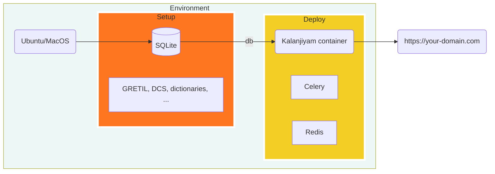
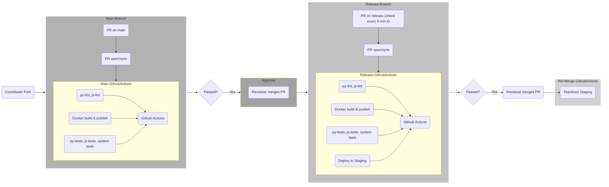

## Deployment environments

| Directory | Environment | Container Suffix | Default Web Port | Storage | DB password |
|-----------|-------------|------------------|------------------|---------|-------------|
| `deploy/local/` | Local Docker dev | `-dev` | `5002` | S3 via versitygw (named volume) | hardcoded `kalanjiyam` |
| `deploy/staging/` | CI / staging | `-staging` | `5001` | `local` (no S3 gateway) | hardcoded `kalanjiyam` |
| `deploy/prod/` | Production Docker | `-prod` | `5000` | S3 via versitygw (`~/kalanjiyam-data/uploads`) | `POSTGRES_PASSWORD` from `.env` |

All three read `../../.env` via `env_file`. Configure `.env` from `.env.example` before starting.

**Production** — use `deploy/prod/deploy.sh` (validates `.env`, builds image, runs migrations, starts services):

```bash
cp .env.example .env   # fill in all required values
./deploy/prod/deploy.sh
./deploy/prod/deploy.sh logs     # tail logs
./deploy/prod/deploy.sh restart  # restart without rebuild
./deploy/prod/deploy.sh stop     # tear down
```

**Staging** — use `deploy/staging/deploy.sh`:

```bash
./deploy/staging/deploy.sh
./deploy/staging/deploy.sh logs     # tail logs
./deploy/staging/deploy.sh stop     # tear down
```

**Local / Dev** — use `deploy/local/deploy.sh` (or `make docker-start`):

```bash
./deploy/local/deploy.sh
./deploy/local/deploy.sh logs     # tail logs
./deploy/local/deploy.sh stop     # tear down
```

Celery listens on `default` and `ocr` queues in all environments. OCR runs as a separate
service; set `OCR_SERVICE_URL` to a host reachable from inside containers.

Full guide: `docs/production-deploy.rst`.

## File storage

Uploads (source PDFs, page images, editor images) go through an S3-compatible
storage layer (`kalanjiyam/utils/storage.py`). The backend is chosen by config:

| `.env` key | Values | Notes |
|------------|--------|-------|
| `STORAGE_BACKEND` | `s3` (default in compose) or `local` | `local` writes directly under `FLASK_UPLOAD_FOLDER` |
| `S3_ENDPOINT_URL` | URL | Set by compose to the bundled gateway; point at MinIO/SeaweedFS/Ceph/AWS to swap backends |
| `S3_BUCKET` | name | Default `uploads` |
| `S3_ACCESS_KEY_ID` / `S3_SECRET_ACCESS_KEY` | strings | Required when `STORAGE_BACKEND=s3` |
| `S3_REGION` | region | Optional; self-hosted gateways ignore it |
| `S3_PUBLIC_ENDPOINT_URL` | URL | Optional; if set, page images redirect to presigned URLs instead of streaming through Flask |

The bundled gateway is [Versity Gateway](https://github.com/versity/versitygw)
(Apache 2.0), running in POSIX mode over the existing data directory. Files on
disk stay plain files: in prod, `~/kalanjiyam-data/uploads/` is exposed as the
`uploads` bucket, so **pre-existing uploads need no migration**. To move a
deployment to a different S3 backend later, sync the objects (`rclone sync` /
`aws s3 sync`) and change the endpoint/credential values — no code changes.

## How it works?



## What is the PR process?


